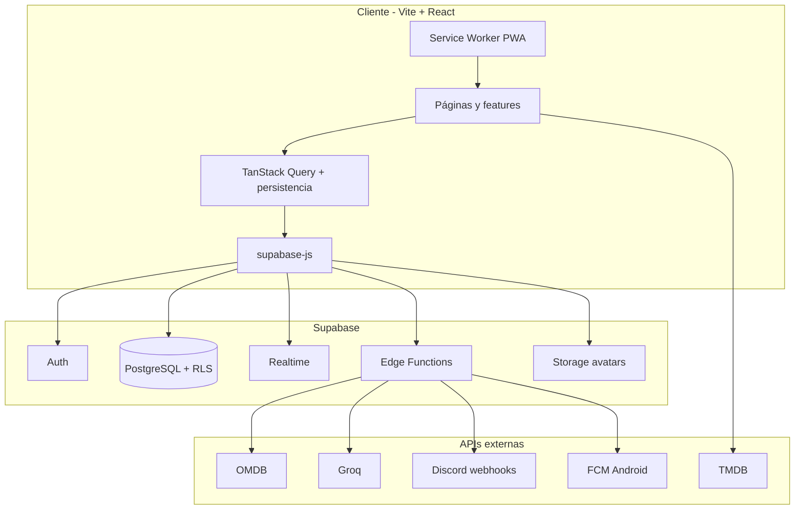

# Arquitectura

Visión general de **WhichNext**: SPA React con backend Supabase (PostgreSQL + Auth + Realtime + Edge Functions).

---

## Diagrama de capas

- **TMDB** se llama desde el navegador solo si existe `VITE_TMDB_ACCESS_TOKEN` (enriquecimiento de metadatos).
- **OMDB y Groq** solo pasan por Edge Functions (claves en servidor).

---

## Punto de entrada

| Archivo | Rol |
|---------|-----|
| `src/main.tsx` | Tema persistido, i18n, Sentry, `PersistQueryClientProvider`, `BrowserRouter` |
| `src/App.tsx` | Fondos por tema (`CyberpunkLinesBackground`, `TerminalMatrixBackground`), `AppShell` |
| `src/app/AppShell.tsx` | Auth gate, `Login` / `JoinList` / layout con navbar |
| `src/app/AppRoutes.tsx` | Rutas autenticadas con lazy loading y error boundaries |

---

## Rutas

| Ruta | Componente | Auth |
|------|------------|------|
| `/` | `Dashboard` | Sí |
| `/peliculas` | `Peliculas` | Sí |
| `/series` | `Series` | Sí |
| `/perfil` | `Perfil` | Sí |
| `/ajustes` | `Ajustes` | Sí |
| `/join/:code` | `JoinList` | Opcional (redirige a login si hace falta) |
| (sin sesión) | `Login` | No |

`JoinList` se renderiza desde `AppShell` cuando la URL coincide `/join/:code`, fuera del layout con navbar.

---

## Organización `src/features/`

Patrón por dominio (vertical slice):

| Carpeta | Responsabilidad |
|---------|-----------------|
| `auth/` | `AuthProvider`, sesión Supabase, username pendiente |
| `lists/` | Listas, miembros, invitaciones, Activity Feed, modales de lista |
| `items/` | Tarjetas, ratings, comentarios, crítica rápida, búsqueda, TMDB |
| `oracle/` | Recomendaciones IA (Oráculo) |
| `profile/` | Perfil de usuario, estadísticas |
| `navigation/` | `AppNavbar` |
| `invites/` | Invitación pendiente post-login |
| `onboarding/` | Modal de username inicial |
| `shared/` | Tema, diálogos, fondos animados, tipos, utilidades |
| `app/` | Boot screen |

Páginas finas en `src/pages/` que componen features.

---

## Estado y caché

- **TanStack Query** con claves centralizadas en `src/config/queryKeys.ts`.
- **Persistencia offline** (`queryPersistence.ts`): listas, ítems y perfil; `networkMode: offlineFirst` en lecturas.
- **Tema:** `useTheme` → `user_profiles.theme_preference` + `data-theme` en `<html>` + Capacitor storage.
- **Lista activa:** contexto/hooks en lists (selector en Películas/Series).

---

## Tiempo real

Suscripciones Supabase Realtime en hooks de listas/ítems para refrescar la UI cuando otro miembro cambia datos (según políticas RLS).

---

## PWA y push

- Manifest y Workbox: `vite.config.ts`, SW custom `src/sw.ts` (`injectManifest`).
- Push web: `send-push` + suscripciones en BD.
- Android FCM: migraciones `23+`, orquestación en `push-orchestrator`.
- Discord: webhook por lista → ver [DISCORD_WEBHOOK.md](./DISCORD_WEBHOOK.md).

---

## Internacionalización

- `src/i18n.ts` + `src/locales/{es,en}/*.json`
- Namespaces: `common`, `auth`, `content`, `profile`, etc.
- `LanguageSwitcher` en login y ajustes.

---

## Seguridad en cliente

- RLS en todas las tablas sensibles; el anon key no sustituye políticas.
- Validación de formularios en `features/shared/lib/validation.ts`.
- IA y OMDB nunca exponen API keys en el bundle.

Detalle de BD: [DATABASE.md](./DATABASE.md). APIs: [INTEGRATIONS.md](./INTEGRATIONS.md).
