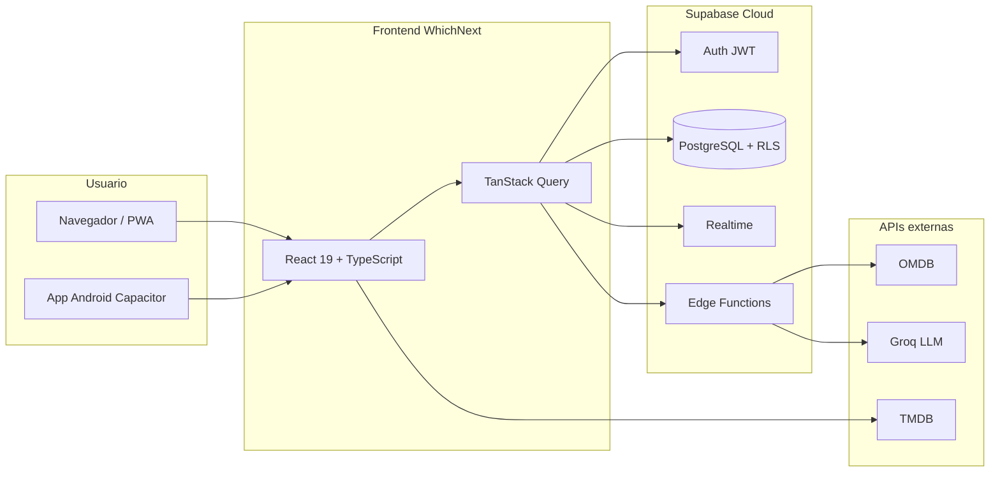

# WhichNext — Guion de presentación para TFG

**Documento orientado a la defensa oral ante el tribunal académico.**

**Duración objetivo de la exposición: 5 a 10 minutos** (sin contar el turno de preguntas del tribunal).

| Campo | Rellena antes de la defensa |
|-------|----------------------------|
| Alumno/a | [Nombre y apellidos] |
| Tutor/a | [Nombre del tutor] |
| Centro / titulación | [Universidad, grado, curso 2025–2026] |
| Título oficial del TFG | [Título tal como consta en la memoria] |
| Fecha de defensa | [DD/MM/AAAA] |
| URL de demostración | [https://jandn.onrender.com/](https://jandn.onrender.com/) o entorno local |
| Duración elegida | ☐ 5 min ☐ 8 min ☐ 10 min |

---

## Guion principal (elige 5, 8 o 10 minutos)

Usa **solo una** de las tres rutas. El resto del documento es material de apoyo si el tribunal pregunta en profundidad.

### Ruta A — 5 minutos (exposición + demo integrada)

| Min | Qué haces | Qué dices (esencia) |
|-----|-----------|---------------------|
| 0:00–0:40 | Diapositiva portada → problema | «WhichNext: listas compartidas de cine/series para grupos. Problema: decidir qué ver sin perder el historial de cada uno.» |
| 0:40–1:20 | Objetivo + stack (1 diapositiva) | «PWA en React/TypeScript, Supabase con RLS, OMDB/TMDB y IA vía Edge Functions sin exponer claves.» |
| 1:20–4:00 | **Demo en vivo** (6 pasos, sección 19A) | Login → lista → buscar y añadir → marcar visto con crítica rápida. Habla poco; que se vea la app. |
| 4:00–4:40 | Resultado + conclusión | «App desplegada, colaboración real, tests y CI. Objetivo cumplido.» |
| 4:40–5:00 | «¿Preguntas?» | Cierre. |

**Diapositivas recomendadas: 5–6** (portada, problema, arquitectura resumida, captura app, conclusiones, gracias).

---

### Ruta B — 8 minutos (equilibrio oral + demo)

| Min | Bloque |
|-----|--------|
| 0:00–1:00 | Contexto y problema (elevator pitch + 2 viñetas) |
| 1:00–2:00 | Objetivos (general + 3 específicos en pantalla) |
| 2:00–3:30 | Arquitectura: diagrama de capas + tabla stack (no leas todo; señala Supabase, RLS, Edge Functions) |
| 3:30–6:30 | Demo en vivo (8 pasos, sección 19B) |
| 6:30–7:30 | Seguridad (1 frase RLS) + pruebas (Vitest/Playwright/CI) + despliegue |
| 7:30–8:00 | Conclusiones (3 frases) |

**Diapositivas recomendadas: 8–10.**

---

### Ruta C — 10 minutos (más contexto técnico)

| Min | Bloque |
|-----|--------|
| 0:00–1:30 | Contexto, problema y objetivos |
| 1:30–3:30 | Funcionalidades clave (tabla resumida, sección 8) + arquitectura |
| 3:30–4:30 | Seguridad y metodología/pruebas (fusionado) |
| 4:30–8:30 | Demo en vivo (10 pasos, sección 19C) |
| 8:30–9:30 | Resultados, una limitación y una línea de trabajo futuro |
| 9:30–10:00 | Conclusiones |

**Diapositivas recomendadas: 10–12** (máximo ~1 diapositiva por minuto).

---

### Reglas para no pasarte de tiempo

1. **Ensaya con cronómetro** al menos dos veces (5 min y 10 min).
2. En 5 minutos **no** expliques migraciones ni detalle de RLS; solo mención.
3. La demo es el centro: cuenta con **60–70 % del tiempo** en rutas A y B.
4. Si el tribunal interrumpe, acorta la demo y deja conclusiones en 20 s.
5. Ten la **cuenta de prueba** y la **lista ya cargada** antes de entrar.

---

## 1. Resumen en 40 segundos (elevator pitch — versión corta)

> **WhichNext** es una aplicación web progresiva (PWA) que permite a grupos de personas —familia, amigos, pareja— **gestionar listas compartidas** de películas y series. Cada miembro mantiene su propio estado de «visto» o «pendiente», puede valorar y comentar títulos, recibir sugerencias asistidas por inteligencia artificial y colaborar en tiempo casi real. El proyecto integra un frontend moderno en **React y TypeScript**, un backend gestionado con **Supabase** (PostgreSQL con seguridad a nivel de fila) y servicios externos controlados mediante **Edge Functions**, priorizando la **privacidad de las API keys** y la **experiencia multiplataforma** (navegador y Android vía Capacitor).

Usa la **versión corta** en exposiciones de 5–8 min. Si necesitas más detalle (pregunta del tribunal), usa el párrafo extendido:

> …colaborar en tiempo casi real. Integra **React y TypeScript**, **Supabase** (PostgreSQL con RLS) y **Edge Functions** para OMDB e IA, con PWA y soporte Android (Capacitor).

---

## 2. Índice de referencia (material de apoyo, no oral completo)

Las secciones 3–22 amplían contenido para preguntas del tribunal o para la memoria escrita. **No intentes leerlas todas en 5–10 minutos.** Sigue el **Guion principal** de arriba.

---

## 3. Contexto y motivación

### 3.1 Situación

En hogares y grupos de amistad es habitual discutir **qué ver** en una noche de cine o en maratones de series. Las soluciones habituales —notas en el móvil, listas en papel, hojas compartidas genéricas o mensajes en grupos de chat— presentan limitaciones:

- No distinguen bien **película** frente a **serie**.
- No registran de forma estructurada **quién ya ha visto** cada título en un grupo.
- No ofrecen **búsqueda unificada** de metadatos (póster, sinopsis, plataformas).
- La **colaboración** y el **historial de cambios** suelen ser pobres o inexistentes.

### 3.2 Oportunidad tecnológica

Las **aplicaciones web progresivas**, los **backends como servicio (BaaS)** y las **APIs de catálogo cinematográfico** permiten hoy construir una solución especializada sin mantener infraestructura propia de servidores. La integración responsable de **modelos de lenguaje** (IA generativa) puede ayudar a **redactar reseñas** y a **sugerir títulos** según preferencias explícitas del usuario.

### 3.3 Motivación del proyecto

El TFG aborda el diseño e implementación de una herramienta **específica para el dominio audiovisual compartido**, con énfasis en:

- Usabilidad en **móvil y escritorio**.
- **Colaboración multiusuario** con permisos claros.
- **Seguridad** (autenticación, RLS, secretos en servidor).
- **Calidad de software** (tipado, tests, CI).

---

## 4. Planteamiento del problema

**Problema:** ¿Cómo diseñar e implementar una aplicación web que permita a varios usuarios autenticados crear y compartir listas de películas y series, gestionar de forma individual el estado de visionado, valorar y comentar títulos, enriquecer la información con fuentes externas y ofrecer asistencia inteligente para la decisión de qué ver, garantizando seguridad, rendimiento aceptable y mantenibilidad del código?

**Preguntas derivadas que el sistema responde:**

1. ¿Cómo modelar en base de datos listas compartidas sin que el estado «visto» de un usuario afecte al de otro?
2. ¿Cómo integrar búsqueda y metadatos sin exponer claves de API en el cliente?
3. ¿Cómo notificar al grupo (Discord, push) sin acoplar la lógica al frontend?
4. ¿Cómo ofrecer una experiencia usable sin conexión para consulta de datos ya cargados?

---

## 5. Objetivos

### 5.1 Objetivo general

Desarrollar **WhichNext**, una aplicación web progresiva para la **gestión colaborativa de listas de películas y series**, con autenticación, persistencia en la nube, integración de servicios externos e interfaz adaptable a distintos dispositivos y temas visuales.

### 5.2 Objetivos específicos

| # | Objetivo | Criterio de cumplimiento |
|---|----------|--------------------------|
| OE1 | Modelar datos y reglas de acceso en PostgreSQL con RLS | Migraciones versionadas; políticas por membresía de lista |
| OE2 | Implementar cliente SPA mantenible | React 19 + TypeScript; organización por features |
| OE3 | Integrar búsqueda OMDB de forma segura | Edge Function `search-omdb` + rate limiting |
| OE4 | Enriquecer títulos con TMDB (opcional) | Póster, título ES, sinopsis, «dónde verlo» |
| OE5 | Permitir valoración, comentarios y crítica rápida al marcar visto | RPC `save_quick_critique`; UI por tema |
| OE6 | Ofrecer recomendaciones IA (Oráculo) sin clave en el navegador | Edge Function `ai-proxy` + Groq |
| OE7 | Soportar colaboración e historial | Realtime; Activity Feed desde auditoría |
| OE8 | Garantizar calidad | Tests Vitest + E2E Playwright; pipeline CI |
| OE9 | Desplegar y demostrar en producción | Build Vite; hosting; PWA |

Adapta la numeración si tu memoria escrita define otros objetivos; mantén coherencia entre memoria y defensa.

---

## 6. Estado del arte y alternativas consideradas

| Alternativa | Ventaja | Limitación respecto a WhichNext |
|-------------|---------|--------------------------------|
| Letterboxd, Filmaffinity, etc. | Catálogo maduro | Enfoque en red social individual, no listas de grupo a medida |
| Notion / Google Sheets | Flexibilidad | Sin modelo «visto por usuario», sin OMDB/TMDB integrado |
| Listas de Netflix/Prime | Integración plataforma | Cerradas a un solo proveedor; no multi-plataforma |
| App monolito propio (Node + MySQL) | Control total | Mayor coste de despliegue y mantenimiento |

**Posicionamiento de WhichNext:** herramienta **vertical** para grupos pequeños, **open source** en el repositorio del TFG, con **control del dato** en Supabase y **extensible** (webhooks, export/import).

---

## 7. Descripción de la solución

### 7.1 Nombre y propuesta de valor

- **Nombre comercial en UI:** WhichNext («¿Qué vemos después?»).
- **Propuesta de valor:** decidir juntos qué ver, con listas compartidas, estados individuales, valoraciones y ayuda opcional de IA.

### 7.2 Perfiles de usuario

| Perfil | Acciones típicas |
|--------|------------------|
| **Propietario de lista** | Crear lista, invitar, webhook Discord, export/import, configuración |
| **Miembro / admin** | Añadir ítems, marcar visto, valorar, comentar, ver feed |
| **Visitante no autenticado** | Solo flujo de invitación → redirección a login |

### 7.3 Flujo principal (narrativa para el tribunal)

1. El usuario se **registra o inicia sesión** (Supabase Auth).
2. **Crea una lista** o **acepta una invitación** (`/join/:code`).
3. En **Películas** o **Series**, **busca** un título (OMDB vía servidor).
4. **Añade** el ítem a la lista activa; opcionalmente TMDB enriquece metadatos.
5. Cuando lo ve, abre **crítica rápida** (estrellas, me gusta/no, comentario).
6. El grupo consulta el **Activity Feed** y puede usar el **selector aleatorio** o el **Oráculo** para decidir.
7. El propietario puede **exportar** la lista o recibir **avisos en Discord** al añadir títulos.

---

## 8. Funcionalidades destacadas (para la demo y las diapositivas)

Agrupa en la exposición las que mejor demuestren el alcance del TFG:

| Área | Funcionalidad | Detalle técnico breve |
|------|---------------|------------------------|
| Colaboración | Listas compartidas + invitación por código | Tablas `lists`, `list_members`; RLS |
| Estado individual | Visto/pendiente por usuario | `item_user_watch` |
| Catálogo | Búsqueda y alta de títulos | Edge `search-omdb`; unicidad por lista/tipo/título |
| Metadatos | Póster, ES, sinopsis, dónde verlo | TMDB en cliente (token opcional) |
| Social | Valoraciones, comentarios, feed | `item_ratings`, `item_comments`, `audit_logs` |
| Organización | Etiquetas, orden manual (drag), cola «siguiente» | `tags`, `sort_index`, `next_queue_item_id` |
| Decisión | Aleatorio + Oráculo IA | UI + `ai-proxy` / Groq |
| Datos | Export/import JSON y CSV | Utilidades en `listItemsImportExport` |
| Notificaciones | Discord, Web Push, FCM Android | `push-orchestrator` |
| UX | Tres temas + PWA + i18n ES/EN | `data-theme`; Service Worker |
| Accesibilidad | `prefers-reduced-motion` en fondos animados | Canvas estático si el usuario lo pide |

No es necesario demostrar las diez en la defensa; prioriza **lista compartida → búsqueda → crítica rápida → Oráculo o feed**.

---

## 9. Arquitectura del sistema

### 9.1 Estilo arquitectónico

- **Cliente:** SPA (Single Page Application) desacoplada.
- **Servidor:** modelo **BaaS** — Supabase concentra Auth, API REST/Realtime, Storage y Functions.
- **Integraciones:** adaptadores hacia OMDB, TMDB, Groq, Discord y FCM.

### 9.2 Diagrama de capas (para diapositiva)

### 9.3 Organización del código

- **`src/features/`** — Dominios: `auth`, `lists`, `items`, `oracle`, `profile`, `shared`, etc.
- **`src/pages/`** — Vistas de ruta (Dashboard, Películas, Series, Perfil, Ajustes, Login, Join).
- **`supabase/migrations/`** — Esquema evolutivo (más de 30 migraciones numeradas).
- **`supabase/functions/`** — Lógica serverless: `search-omdb`, `ai-proxy`, `push-orchestrator`, `send-push`.

Ventaja para el TFG: separación clara **UI / lógica de negocio / persistencia / integraciones**.

### 9.4 Stack tecnológico (tabla para diapositiva)

| Capa | Tecnología | Versión orientativa |
|------|------------|---------------------|
| UI | React | 19.x |
| Lenguaje | TypeScript | 5.5 |
| Build | Vite | 7.x |
| Estilos | Tailwind CSS | 4.x |
| Routing | React Router | 7.x |
| Estado servidor | TanStack Query | 5.x |
| Backend | Supabase (Postgres, Auth, Realtime, Functions) | 2.x |
| Móvil | Capacitor | 8.x |
| Tests | Vitest, Playwright | 4.x / última |
| CI | GitHub Actions | — |
| IA | Groq (vía Edge Function) | API REST |
| Catálogo | OMDB + TMDB | APIs REST |

---

## 10. Diseño de interfaz y experiencia de usuario

### 10.1 Principios aplicados

- **Responsive:** rejilla de tarjetas, navbar adaptable, menú móvil.
- **Feedback:** estados de carga, errores con boundaries y Sentry opcional.
- **Identidad visual:** tres temas con tokens CSS (`data-theme`).
- **Internacionalización:** español e inglés (i18next).

### 10.2 Temas como aportación de diseño

| Tema | Metáfora visual | Implementación destacada |
|------|-----------------|---------------------------|
| Cyberpunk | Neón / ciencia ficción | Canvas de líneas animadas; superficies con glow |
| Terminal | Consola hacker | Lluvia Matrix en canvas; tipografía monoespaciada |
| Retro cartoon | Cómic / neubrutalismo | Bordes gruesos; animación «Meep Meep» en modales |

Demostrar un **cambio de tema en Ajustes** transmite cuidado por la UX y dominio de CSS moderno.

---

## 11. Seguridad, privacidad y buenas prácticas

Puntos que suelen interesar al tribunal:

| Tema | Medida implementada |
|------|---------------------|
| Autenticación | Supabase Auth (email/contraseña; OAuth Google opcional) |
| Autorización | **Row Level Security** en todas las tablas sensibles |
| Secretos | `OMDB_API_KEY` y `GROQ_API_KEY` solo en Edge Functions |
| Abuso de API | Rate limiting en búsqueda OMDB (~30/h por usuario) |
| Validación | Constraints SQL + validación en formularios cliente |
| Transporte | HTTPS en producción |
| Observabilidad | Sentry opcional en build de producción |
| Datos personales | Perfil (username, bio, avatar en Storage); mínimo necesario |

**Mensaje clave:** el frontend solo dispone de la **anon key** de Supabase; el acceso real lo limita **RLS**, no la oscuridad de la clave.

---

## 12. Metodología de desarrollo

Describe en la defensa (alineado con tu memoria):

- Desarrollo **iterativo** por funcionalidades (listas → ítems → ratings → IA → push → temas).
- Control de versiones con **Git** y revisión mediante **pull requests** (si aplica).
- **Migraciones** SQL versionadas como única fuente de verdad del esquema.
- Documentación en **`docs/`** y README para reproducibilidad.

Si tu centro exige mencionar SCRUM, cascada o prototipado, adapta este apartado sin contradecir lo que conste en la memoria escrita.

---

## 13. Pruebas y aseguramiento de la calidad

| Tipo | Herramienta | Qué cubre |
|------|-------------|-----------|
| Unitario / integración ligera | Vitest + Testing Library | Hooks (`useItems`, `useItemRating`), utilidades import/export |
| E2E | Playwright | Smoke de carga; login opcional con credenciales `E2E_*` |
| Estático | ESLint + TypeScript | Errores de tipos y estilo |
| CI | GitHub Actions | Lint, tests, build en Node 18 y 20 |

**Frase para el tribunal:** «La calidad no se limita a pruebas manuales; hay automatización en pipeline y tests sobre lógica crítica de negocio.»

---

## 14. Despliegue y entorno de demostración

- **Build:** `npm run build` → assets estáticos en `dist/`.
- **Hosting de referencia:** [https://jandn.onrender.com/](https://jandn.onrender.com/) (o el URL que indiques).
- **PWA:** manifest + Service Worker (`src/sw.ts`, Workbox).
- **Android:** Capacitor sync tras build.

**Recomendación para el día de la defensa:** tener **copia local** (`npm run dev`) por si falla la red del aula, y una **cuenta de prueba** con listas ya pobladas.

---

## 15. Resultados obtenidos

Resultados **verificables** que puedes afirmar ante el tribunal:

1. Aplicación **funcional desplegada** y usable desde navegador y como PWA.
2. **Colaboración real** entre varios usuarios sobre la misma lista con estados de visto independientes.
3. Integración **OMDB + TMDB + Groq** con arquitectura de secretos en servidor (IA y búsqueda).
4. **Más de 30 migraciones** SQL que documentan la evolución del modelo de datos.
5. **Suite de tests** automatizados y CI configurada.
6. **Tres identidades visuales** completas más internacionalización.
7. Documentación técnica estructurada en **`docs/`** y material de defensa en **`docs/tfg/`**.

Si tu memoria incluye métricas (líneas de código, número de tests, tiempos de carga), incorpóralas aquí con cifras actualizadas.

---

## 16. Limitaciones del trabajo

Ser honesto refuerza la credibilidad ante el tribunal:

| Limitación | Comentario |
|------------|------------|
| Dependencia de Supabase y APIs externas | Coste, cuotas y disponibilidad de terceros |
| TMDB opcional en cliente | Sin token, metadatos más pobres |
| IA dependiente de Groq | Calidad y coste del modelo; no entrenamiento propio |
| Sin recomendador propio offline | Oráculo requiere red y API |
| Escala no probada para miles de usuarios | Diseño orientado a grupos pequeños |
| `package.json` con nombre histórico | `app-web-jimjos`; marca UI es WhichNext |

---

## 17. Trabajo futuro

Ideas para la diapositiva «líneas futuras»:

- Recomendaciones colaborativas (filtrado por gustos del grupo, no solo del usuario).
- Sincronización con APIs de streaming (JustWatch, etc.) si las condiciones legales lo permiten.
- Modo «sesión de visionado» con votación en tiempo real.
- Más idiomas y accesibilidad WCAG auditada.
- Tests E2E ampliados (flujos de invitación, import CSV).
- Publicación en stores (Google Play) con pipeline de releases.

---

## 18. Conclusiones

**Conclusión 1 — Objetivo cumplido:** se ha diseñado e implementado WhichNext, una PWA que resuelve la gestión colaborativa de listas audiovisuales con un stack moderno y mantenible.

**Conclusión 2 — Competencias demostradas:** diseño de bases de datos con RLS, desarrollo frontend avanzado, integración de APIs, serverless, seguridad básica en aplicaciones web, pruebas automatizadas y despliegue.

**Conclusión 3 — Valor del trabajo:** aporta una solución especializada frente a herramientas genéricas, con funciones diferenciadoras (visto por miembro, Oráculo, feed de actividad, temas, exportación).

**Cierre oral (5–10 min):** «Hemos visto WhichNext en funcionamiento; el objetivo del TFG queda cumplido. Quedo a sus preguntas.»

---

## 19. Guion de demostración en vivo

Ten la **lista activa** con varios títulos y la **sesión ya iniciada** si el aula lo permite (ahorra 30–45 s).

### 19A — Demo mínima (~2,5 min) — para ruta de **5 minutos**

| Paso | Tiempo | Acción | Una frase |
|------|--------|--------|-----------|
| 1 | 15 s | Abrir app (URL o local) | «PWA WhichNext.» |
| 2 | 20 s | Login (o ya logueado) | «Auth con Supabase.» |
| 3 | 20 s | Películas + lista activa | «Lista compartida del grupo.» |
| 4 | 40 s | Buscar y **añadir** un título | «Búsqueda OMDB en servidor, sin clave en el cliente.» |
| 5 | 50 s | **Marcar visto** → crítica rápida → guardar | «Cada uno su estado; valoración en un paso.» |
| 6 | 25 s | Mostrar pendiente/visto o feed (rápido) | «El resto del grupo ve el cambio en el historial.» |

**No hagas** en 5 min: Oráculo, temas, export, join, ajustes de perfil.

---

### 19B — Demo estándar (~3 min) — para ruta de **8 minutos**

Pasos 1–6 de 19A, más:

| Paso | Tiempo | Acción | Una frase |
|------|--------|--------|-----------|
| 7 | 25 s | Abrir **detalle** de un ítem (sinopsis / dónde verlo) | «Enriquecimiento TMDB opcional.» |
| 8 | 20 s | **Activity Feed** o selector aleatorio (uno solo) | «Colaboración visible / decisión rápida.» |

---

### 19C — Demo ampliada (~4 min) — para ruta de **10 minutos**

Pasos 1–8 de 19B, más **uno** de estos (no los dos):

| Opción | Acción | Una frase |
|--------|--------|-----------|
| A | **Oráculo** en Dashboard | «Tres sugerencias con IA; Groq solo en Edge Function.» |
| B | **Ajustes** → cambiar tema (Terminal/Retro) | «Tres identidades visuales completas.» |

Opcional si sobra tiempo (10 s): mencionar export JSON en ajustes de lista.

Si falla Internet: **demo local** (`npm run dev`) y una frase: «En producción: front estático + Supabase en la nube.»

---

## 20. Esquema de diapositivas (5, 8 o 10 minutos)

### Pack corto — **5–6 diapositivas** (exposición ~2 min + demo ~3 min)

| # | Título | Contenido |
|---|--------|-----------|
| 1 | Portada | Título TFG, nombre, tutor, fecha |
| 2 | Problema y objetivo | «¿Qué vemos?» + objetivo general en 3 viñetas |
| 3 | Solución + arquitectura | Captura WhichNext + mini diagrama (React → Supabase → APIs) |
| 4 | Demo | Título «Demostración en vivo» (pantalla en vivo, no texto) |
| 5 | Resultados y conclusiones | 3 viñetas verificables + cierre |
| 6 | Gracias / preguntas | QR o URL opcional |

---

### Pack medio — **8–10 diapositivas** (exposición ~4–5 min + demo ~3–4 min)

| # | Título | Contenido |
|---|--------|-----------|
| 1 | Portada | |
| 2 | Motivación | 3 limitaciones de chat/listas genéricas |
| 3 | Objetivos | General + 3 específicos |
| 4 | WhichNext | Captura dashboard |
| 5 | Funcionalidades | 6 iconos: listas, visto individual, búsqueda, valoración, Oráculo, feed |
| 6 | Arquitectura | Diagrama sección 9.2 |
| 7 | Seguridad y calidad | RLS + Edge Functions + Vitest/CI (mitad diapositiva cada uno) |
| 8 | Demo | «En vivo» |
| 9 | Conclusiones | 3 frases |
| 10 | Preguntas | |

---

### Pack largo — **10–12 diapositivas** (solo si usas los **10 minutos** completos)

Añade al pack medio: **Estado del arte** (tabla 1 fila), **Temas visuales** (3 capturas pequeñas), **Limitaciones** (2 viñetas). No superes **12 diapositivas**.

**Consejo:** en 5–10 minutos, **menos texto por diapositiva**; tú explicas, la slide apoya.

---

## 21. Preguntas habituales del tribunal y cómo responder

Esta sección recoge las preguntas **más frecuentes** en defensas de TFG en España (especialmente proyectos de software e informática), con **respuestas orientadas a WhichNext**. Ensaya cada respuesta en **60–90 segundos** (unas 8–12 frases).

Fuentes de referencia sobre el tipo de preguntas: guías de defensa oral ([UDC](https://infoguias.biblioteca.udc.es/TFG_es/exponer), [Tesify](https://tesify.es/acto-defensa-tfg-protocolo-que-decir-10-minutos-2026), [GradosTesisyMasters](https://gradostesisymasters.com/guia-completa-de-preguntas-del-tribunal-de-tfg-y-como-dirigirse-a-los-evaluadores/), [Aprueba Todo](https://apruebatodo.com/blog/como-estar-preparado-para-cualquier-pregunta-del-tribunal-en-tu-tfg-o-tfm/)).

---

### Cómo responder bien (antes de cada respuesta concreta)

1. **Escucha la pregunta completa** sin interrumpir; puedes anotar una palabra clave.
2. **Estructura:** (a) respuesta directa en una frase → (b) argumento o ejemplo del proyecto → (c) cierre breve.
3. **No inventes:** si no lo sabes, di «no lo implementé / no lo medí» y enlaza con lo que sí hiciste o con trabajo futuro.
4. **No leas** la memoria; demuestra que **entiendes** lo que programaste.
5. Si preguntan algo que **no salió en la presentación de 5–10 min**, no te justifiques solo con el tiempo: **responde con contenido** («En la exposición no lo detallé por tiempo; el diseño es el siguiente…»).

---

### A. Tema, motivación y aportación

#### «¿Por qué elegiste este tema?» / «¿Qué problema resuelve?»

**Cómo responder:** En grupos es difícil acordar qué ver; las listas genéricas no separan película/serie ni el «visto» de cada persona. WhichNext es una herramienta **específica para ese dominio**, con colaboración y metadatos de cine.

**Frase lista:** «El problema es la fricción al decidir qué ver en grupo sin perder historial individual. La solución es una PWA de listas compartidas con estado de visionado por miembro, búsqueda de catálogo y ayuda opcional con IA.»

---

#### «¿Qué aporta tu trabajo respecto a Letterboxd, Notion o un grupo de WhatsApp?»

**Cómo responder:** No compite con redes sociales globales; **verticaliza** el caso de uso: varios usuarios, una lista, permisos, visto individual, feed de actividad, export/import y notificaciones al grupo. WhatsApp no modela datos ni búsqueda OMDB/TMDB.

**Frase lista:** «La aportación es el modelo de datos colaborativo y las funciones integradas (OMDB, crítica rápida, Oráculo, Discord) en un solo producto, no una lista de chat.»

---

#### «¿Cuál es la contribución original del TFG?»

**Cómo responder:** El **diseño e implementación** del sistema completo: modelo `item_user_watch`, RPC de crítica rápida, Activity Feed desde auditoría, integración segura de APIs, tres temas con identidad propia, PWA + tests + CI. Las librerías son estándar; la **composición y el dominio** son del proyecto.

---

### B. Objetivos

#### «¿Se han cumplido los objetivos?»

**Cómo responder:** Repite el objetivo general y marca **sí/no** por cada objetivo específico de la memoria (OE1–OE9 en sección 5). Ejemplo: «Sí: app desplegada, RLS activo, búsqueda vía Edge Function, tests en CI; parcialmente: IA depende de que el evaluador tenga Groq configurado en Supabase.»

**Consejo:** Lleva una diapositiva o nota con la tabla objetivo → evidencia (captura, migración, test).

---

#### «¿Por qué estos objetivos y no otros?»

**Cómo responder:** Priorizaste un **MVP usable** (listas + ítems + visto + búsqueda) y luego capas (IA, push, temas). Objetivos irreales (recomendador propio entrenado, app nativa completa) quedaron fuera a propósito.

---

### C. Metodología y proceso

#### «¿Qué metodología has seguido?»

**Cómo responder:** Desarrollo **iterativo e incremental** por funcionalidades (listas → ratings → comentarios → IA → notificaciones → temas), con **Git**, migraciones SQL versionadas y documentación en `docs/`. Si tu memoria cita Scrum/Kanban, alinea el vocabulario; si no, no lo inventes.

**Frase lista:** «No fue un único ciclo en cascada: cada iteración añadió valor demostrable y migraciones en Supabase.»

---

#### «¿Cómo has validado el sistema?» / «¿Ha probado usuarios reales?»

**Cómo responder:** Validación **técnica**: tests Vitest en hooks críticos, E2E Playwright, build y CI. Validación **funcional**: uso propio / beta con [X personas o «entorno de prueba con datos reales» — rellena según tu memoria]. Si no hubo usuarios formales, dilo y propón encuestas SUS como trabajo futuro.

---

#### «¿Se puede reproducir el proyecto?»

**Cómo responder:** Sí: repo público/privado, `.env.example`, `supabase db push`, documentación en `docs/GETTING_STARTED.md`. Secretos (OMDB, Groq) van en Supabase, no en el repo.

---

### D. Tecnologías y decisiones técnicas

#### «¿Por qué React y no Angular/Vue?»

**Cómo responder:** Ecosistema amplio, componentes alineados con el TFG, curva ya asumida en el grado, buena integración con Vite y PWA. La elección es **razonable**, no «la única posible».

---

#### «¿Por qué Supabase y no un backend en Node/Java hecho por ti?»

**Cómo responder:** Permite centrarse en **producto e integraciones**: Auth, Postgres, RLS, Realtime y Functions sin montar servidor propio. El TFG demuestra diseño de datos y cliente, no administración de infraestructura. Trade-off: dependencia del proveedor.

---

#### «¿Por qué TypeScript?»

**Cómo responder:** Tipado estático reduce errores en un dominio con muchos modelos (`ListItem`, ratings, temas); refuerza mantenibilidad y encaja con estándares actuales del sector.

---

#### «¿Por qué OMDB y TMDB?»

**Cómo responder:** OMDB para **búsqueda** ligera desde servidor (Edge Function, rate limit). TMDB opcional en cliente para **metadatos ricos** (póster, español, plataformas). Son APIs estándar del sector; no reimplementas un catálogo.

---

### E. Arquitectura, datos y diseño

#### «Explícanos la arquitectura en 30 segundos.»

**Cómo responder:** SPA React → supabase-js → Auth + PostgreSQL (RLS) + Realtime + Edge Functions (OMDB, Groq, push). TMDB desde el navegador si hay token. Diagrama sección 9.2.

---

#### «¿Cómo modelaste el “visto” en listas compartidas?»

**Cómo responder:** Tabla **`item_user_watch`**: cada fila es (ítem, usuario, visto). El ítem pertenece a la lista compartida; el estado de visionado **no es global**. Así un miembro puede marcar visto sin marcar para los demás.

---

#### «¿Por qué Edge Functions y no llamar a OMDB/Groq desde el frontend?»

**Cómo responder:** Las API keys en el cliente serían **extraíbles** del bundle. Las Functions actúan como **proxy** con secretos en servidor, validación de entrada y, en OMDB, rate limiting por usuario.

---

#### «¿Qué es Row Level Security y cómo la usas?»

**Cómo responder:** Políticas en PostgreSQL que filtran filas según `auth.uid()`. Ejemplo: solo ves `items` de listas donde eres miembro en `list_members`. La seguridad no depende de ocultar la anon key.

---

#### «¿Por qué no montaste TechBackground / por qué canvas en cyberpunk y terminal?»

**Cómo responder:** Los fondos animados son **componentes React dedicados** (`CyberpunkLinesBackground`, `TerminalMatrixBackground`) montados solo con su tema, con `prefers-reduced-motion` y sin tapar el contenido (`app-view-layer`). Es decisión de UX, no un video pesado.

---

### F. Resultados, demo y calidad

#### «¿Qué resultados has obtenido?»

**Cómo responder:** Lista la sección 15: app desplegada, colaboración multiusuario, integraciones OMDB/TMDB/Groq, 30+ migraciones, tests + CI, tres temas, documentación. Añade **una cifra** de tu memoria si la tienes (nº tests, líneas, tiempo de carga).

---

#### «¿Qué pasa si falla la demo?»

**Cómo responder:** Tienes plan B: `npm run dev` local, cuenta con datos precargados, capturas en diapositivas. La arquitectura y el repo demuestran el trabajo aunque falle la red del aula.

---

#### «¿Cómo has probado el código?»

**Cómo responder:** Vitest en hooks y utilidades (import/export, ratings), Playwright smoke (y login si hay `E2E_*`), ESLint, TypeScript, GitHub Actions en Node 18/20. No es cobertura total, pero cubre **lógica crítica**.

---

### G. Inteligencia artificial

#### «¿Usas IA? ¿Es ChatGPT en el navegador?»

**Cómo responder:** IA vía **Groq** en la Edge Function **`ai-proxy`**, invocada con JWT del usuario. Usos: mejorar texto de comentarios y **Oráculo** (tres recomendaciones según historial de valoraciones). **No** hay clave de IA en el frontend.

---

#### «¿No es poco riguroso usar IA generativa?»

**Cómo responder:** La IA es **opcional** y **asistiva** (borradores y sugerencias), no sustituye la decisión del usuario. El núcleo del TFG es el sistema de listas y datos; la IA es una capa que se puede desactivar sin Groq configurado.

---

#### «¿Sesgo o privacidad con Groq?»

**Cómo responder:** Solo se envían textos que el usuario elige mejorar o agregados anonimizados de valoraciones para el Oráculo (según implementación — revisa tu memoria). Datos personales de perfil no se envían a Groq. Limitación: dependes de la política del proveedor.

---

### H. Limitaciones, mejoras y trabajo futuro

#### «¿Cuáles son las principales limitaciones?»

**Cómo responder:** Honestidad (sección 16): dependencia de Supabase y APIs, escala no probada para miles de usuarios, TMDB/Groq opcionales, Oráculo requiere red. Muestra **madurez**, no debilidad.

---

#### «¿Qué harías diferente si empezaras de nuevo?»

**Cómo responder:** Ejemplos defendibles: definir antes el modelo `item_user_watch`; más tests E2E desde el inicio; unificar nombre del paquete npm con WhichNext; pruebas de carga ligeras. No critiques todo el proyecto — 1–2 decisiones concretas.

---

#### «¿Qué líneas futuras propones?»

**Cómo responder:** 2–3 de la sección 17: recomendaciones por grupo, más accesibilidad WCAG, publicación en Play Store, sincronización con plataformas de streaming si es viable legalmente.

---

### I. Bibliografía y marco teórico

#### «¿Por qué has usado esta fuente y no otra?»

**Cómo responder:** Cita la fuente de tu memoria (documentación oficial React/Supabase, OWASP, artículo PWA). «Elegí documentación primaria porque describe el comportamiento real de la API que implementé.»

---

#### «¿Cómo se relaciona tu trabajo con la bibliografía?»

**Cómo responder:** El marco teórico justifica BaaS, SPAs, seguridad en aplicaciones web y UX; tu implementación **materializa** esos conceptos en un caso de uso concreto (listas colaborativas audiovisuales).

---

#### «No has hablado del marco teórico en la presentación.»

**Cómo responder:** «En los 5–10 minutos prioricé problema, solución y demo. El marco teórico está en la memoria: [menciona 2 autores o conceptos clave]. Puedo resumirlo ahora si lo desean.»

---

### J. Preguntas «trampa» o de detalle (muy habituales en informática)

| Pregunta | Cómo responder (esencia) |
|----------|---------------------------|
| «¿Qué pasa si dos usuarios marcan visto a la vez?» | Transacciones Postgres; cada uno escribe su fila en `item_user_watch`; sin conflicto de estado global. |
| «¿Cómo evitas duplicar el mismo título en una lista?» | Constraint/migración `30`: unicidad por `(list_id, tipo, título)`. |
| «¿Un miembro puede borrar la lista?» | Solo según rol (owner); RLS y políticas en `lists` / `list_members`. |
| «¿Dónde se guarda la contraseña?» | Supabase Auth (hash en su servicio); no en tablas propias. |
| «¿La app funciona sin internet?» | Lectura de caché React Query persistida; crear/editar requiere red. |
| «¿Es escalable a 100 000 usuarios?» | No probado; diseño para grupos pequeños; escalaría con índices, CDN y pruebas de carga. |
| «¿Has usado IA para escribir el TFG?» | Responde según normativa de tu centro (transparencia). Si usaste asistente para código, indica qué partes revisaste y entiendes. |
| «¿Por qué tres temas visuales?» | Demuestra dominio de CSS, tokens y UX; no afecta al modelo de datos. |
| «¿Qué coste tiene en producción?» | Supabase free tier + Render/hosting estático; APIs con cuotas (OMDB, Groq, TMDB). |
| «¿Cumple RGPD?» | Datos de cuenta en Supabase; minimización (email, perfil); revisar DPA de Supabase y política de privacidad si la tienes publicada. |

---

### K. Cierre del turno de preguntas

Si no sabes algo:

> «Esa parte no la implementé en este TFG / no la medí con datos. Lo que sí puedo decir es [enlaza con algo cercano]. Como línea futura lo abordaría con [idea concreta].»

Si el tribunal está satisfecho:

> «Gracias por las preguntas; quedo a su disposición si necesitan aclarar algún apartado de la memoria o del repositorio.»

---

### L. Checklist rápido antes del día de la defensa

- [ ] Ensayadas 10 respuestas de las categorías A, D, G y H (las más probables en informática).
- [ ] Sabes explicar **RLS**, **item_user_watch** y **ai-proxy** sin mirar notas.
- [ ] Tienes **objetivos cumplidos** en una hoja.
- [ ] Sabes qué **no** incluiste en la presentación corta y puedes desarrollarlo en 1 minuto.
- [ ] Repo y demo local listos por si falla la red.

---

## 22. Referencias y documentación del repositorio

| Recurso | Enlace interno |
|---------|----------------|
| Documentación general | [docs/README.md](../README.md) |
| Instalación | [docs/GETTING_STARTED.md](../GETTING_STARTED.md) |
| Arquitectura | [docs/ARCHITECTURE.md](../ARCHITECTURE.md) |
| Base de datos | [docs/DATABASE.md](../DATABASE.md) |
| Integraciones | [docs/INTEGRATIONS.md](../INTEGRATIONS.md) |
| Temas visuales | [docs/THEMES.md](../THEMES.md) |
| Auditoría técnica | [docs/INFORME_AUDITORIA_TECNICA.md](../INFORME_AUDITORIA_TECNICA.md) |
| Repositorio | [app-web-mylist](https://github.com/JimJos-Calderon/app-web-mylist) |

**Bibliografía sugerida (amplía según tu memoria):** documentación oficial de React, Supabase, OWASP Top Ten, artículos sobre PWA y BaaS.

---

*Documento generado como apoyo a la defensa del TFG. Debe revisarse y alinearse con la memoria escrita oficial antes de la presentación.*
